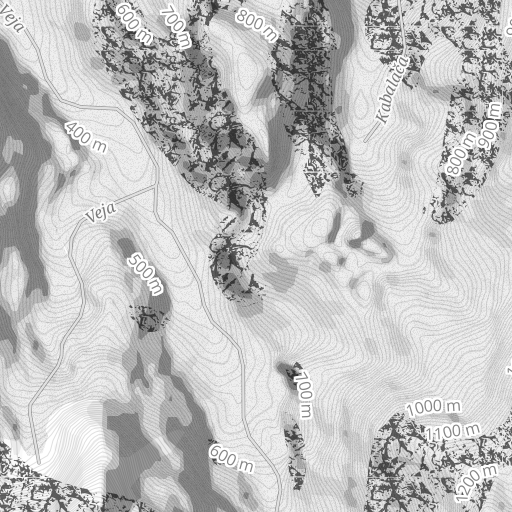

# Safari

A black/white, medium contrast basemap with admin boundaries, roads, very basic landuse coloring, and

### Map Data Layers

Safari uses the following MapBox Studio source layers:

* mapbox.mapbox-streets-v5 *Map data © OpenStreetMap contributors*
* mapbox.mapbox-terrain-v2
* custom GADM layer for admin boundaries
